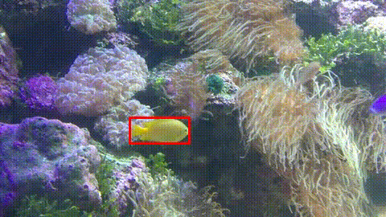

# Color-based Probabilistic Tracking
Implementation for the paper: http://people.rennes.inria.fr/Francois.Le_Gland/ensta/ref/perez02a.pdf
And comparison with the mean shift algorithm

Example using the Meanshift algorithm

