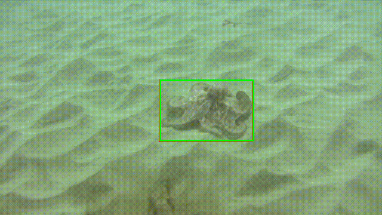

# Color-based Probabilistic Tracking
Implementation for the paper: [1] http://people.rennes.inria.fr/Francois.Le_Gland/ensta/ref/perez02a.pdf
And comparison with the mean shift algorithm.

Example using the Meanshift algorithm

Example using the Color based Tracking [1]

